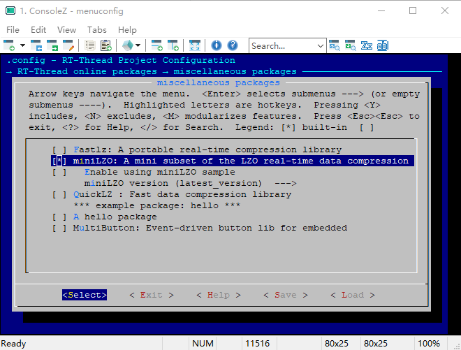

# miniLZO

## 1、介绍

LZO 是一个实时数据压缩库， miniLZO 是 LZO 压缩库的精简版本。 他能够提供非常快速的压缩和解压功能， 解压并不需要内存的支持。 这个 [miniLZO](https://github.com/RT-Thread-packages/miniLZO) 库是 RT-thread 针对官方 [miniLZO](http://www.oberhumer.com/opensource/lzo/) 的C库的移植， 有关 miniLZO 的更多信息，请参阅 [http://www.oberhumer.com/opensource/lzo/](http://www.oberhumer.com/opensource/lzo/) 。

## 2、获取方式

- 使用 menuconfig
```
  RT-Thread online packages --->
      miscellaneous packages --->
          [*] miniLZO: A mini subset of the LZO real-time data compression library
```

## 3、示例介绍

### 3.1 获取示例

- 配置使能示例选项 `Enable using miniLZO sample`
- 配置包版本选为最新版 `latest_version`



### 3.2 运行示例
该示例为一个简单的文件压缩和解压的例程，需要依赖文件系统，用到的命令有两个` -c` 和 `-d`， `-c` 命令压缩一个文件到另一个文件，`-d` 命令解压一个文件到另一个文件。   
使用方式：  
msh cmd 压缩： `minilzo_test -c /file.bin /file.cmprs.bin`  
msh cmd 解压： `minilzo_test -d /file.cmprs.bin /file_dcmprs.bin`  

    msh />minilzo_test -c /file.bin /file.cmprs.bin
    [minilzo]compress start : >>>>>>>>>>>>>>>>>>>>>>>>>>>>>>>>>>>>>>>>>>>>>>>>>>>>>>>>>>>>>>>>>>>>>>>>
    [minilzo]compressed 469848 bytes into 363495 bytes , compression ratio is 77%!
    msh />
    msh />minilzo_test -d /file.cmprs.bin /file_dcmprs.bin
    [minilzo]decompress start : >>>>>>>>>>>>>>>>>>>>>>>>>>>>>>>>>>>>>>>>>>>>>>>>>>>>>>>>>>>>>>>>>>>>>>>>
    [minilzo]decompressed 363495 bytes into 469848 bytes !

## 4、注意事项

### 4.1 与官方源码差异

  miniLZO 源码中定义了一个 `LZO1X_1_MEM_COMPRESS` 大小的压缩内存，占用内存 65536 字节，资源占用高，修改为最小 `8192L * lzo_sizeof_dict_t` 字节，占用内存 32768 字节。

  对源码 `minilzo.h` 进行如下变动，移植官方代码的时候需要注意：

  1. 修改 LZO1X_1_MEM_COMPRESS 大小
  ```C
#define LZO1X_1_MEM_COMPRESS    ((lzo_uint32_t) (16384L * lzo_sizeof_dict_t))
  ```
替换为
  ```C
#define LZO1X_1_MEM_COMPRESS    ((lzo_uint32_t) (8192L * lzo_sizeof_dict_t))
  ```

## 5、参考资料

- miniLZO 官方网站：[http://www.oberhumer.com](http://www.oberhumer.com)
